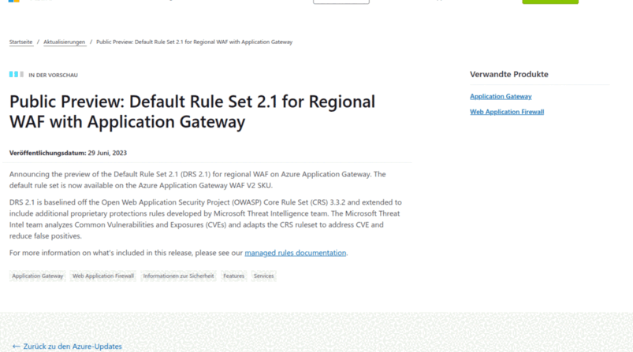

# Blogpost Summarizer

The Blogpost Summarizer is a Python application designed to help you stay up-to-date with the latest developments and updates from Azure's official blog and your internal Confluence blog. This tool automatically fetches, processes, and summarizes content from different blog posts, providing concise and readable summaries of each blog post.

---

## Azure Mode

The Azure Blog Post Summarizer is a Python application designed to help you stay up-to-date with the latest developments and updates from Azure's official blog. This tool automatically fetches, processes, and summarizes content from Azure's RSS feed, providing concise and readable summaries of each blog post.

By utilizing AI powered by OpenAI's GPT-3.5-turbo model, the application condenses detailed technical articles into clear, succinct bullet points, focusing on the key takeaways.

You can configure the tool to focus on specific days or to regularly summarize newly published posts. The results are conveniently delivered to your specified Slack channel, providing a quick and accessible way to keep your team informed about Azure's updates and features.

### Features:

Fetches and processes Azure's RSS feed
Uses OpenAI's GPT-4 model to generate readable summaries
Configurable to summarize specific days or new posts
Delivers summaries to a designated Slack channel
Supports customizable system messages

---

## Confluence mode

In Confluence Mode, the bot checks what blog post it last summarized by checking past Slack messages, then checks if there are any new blog post since it's last summary. If so, it takes the content of the blog post from the Confluence API, and uses the ChatGPT API to create a short summary of it, and posts it along with a link to the blog post into the configured slack channel.

To initialize the bot, you need to make an initial run with the `INITIAL_BLOGPOST_ID` variable set. This will trigger a message with a summary of the blog post. Then on subsequent runs, it will look for the last message. The variable needs to be unset on subsequent runs.

The default prompt we are using to generate Confluence summaries is:

```
Du bist Pexon und erstellst eine lockere Zusammenfassung. Fasse folgenden Text in maximal 150 Wörtern und Bulletpoints zusammen.
Die nachricht sollte für slack formatiert sein.  Nutze für bulletpoints immer ein "-" am anfang der zeile. Übernimm Überschriften der sektionen, und formatiere sie fett, in dem du sie zwischen * packst, wie in diesem beispiel: *Hallo Welt*

Das Ergebnis sollte so aussehen

*Überschrift*
- Bulletpoint
- Bulletpoint
- Bulletpoint
```

---

## Example summary



---

## Build

```bash
docker build -t automation_blogpost .
```

---

## Configuration

| Variable            | Value                                                                                                                                                           |
| ------------------- | --------------------------------------------------------------------------------------------------------------------------------------------------------------- |
| MODE                | Which type of blogpost to summarize. Has to be AZURE or CONFLUENCE                                                                                              |
| BASE_URL            | base URL of your confluence instance                                                                                                                            |
| CONFLUENCE_USERNAME | Confluence user with permission to read blog posts                                                                                                              |
| CONFLUENCE_TOKEN    | API token of your confluence service user                                                                                                                       |
| OPENAI_API_KEY      | OpenAI API key                                                                                                                                                  |
| SLACK_TOKEN         | Slackbot API token                                                                                                                                              |
| SLACK_CHANNEL       | Slack channel ID                                                                                                                                                |
| DEBUG               | If set, the script summarizes the latest blog post                                                                                                              |
| OPENAI_STATEMENT    | if set, the default is overwritten.                                                                                                                             |
| INITIAL_BLOGPOST_ID | If set, summarizes the specified Blog post. Used to initialize the bot since it relies on the latest sent summary to determine the newer blogposts to summarize |
| AZURE_RSS_URL       | The RSS url to fetch blog entries from.                                                                                                                         |
| AZURE_SUMMARY_DATE  | Set this to summarize all Blogposts of a specific day                                                                                                           |
